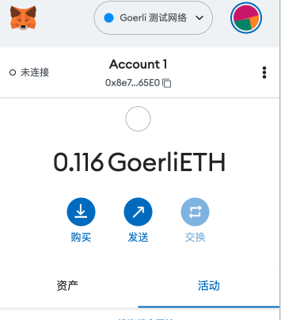

## w1-1作业(2023-03-07)
1. 安装Metamask,并创建好账号
> 

---
2. 执行一次转账
> 交易ID: [0x827e820701cb7300ff63ac9ad13ac40591028c61a56d06196bfa255e7cb54945](https://goerli.etherscan.io/tx/0x827e820701cb7300ff63ac9ad13ac40591028c61a56d06196bfa255e7cb54945)

---
3. 使用Remix创建一个Counter合约并部署, Counter合约有一个add(x)方法
> 合约代码: [点击查看](./Counter.sol)
> 合约地址: [0x4E246568506a159140BE4AA4ccCa5Bec73b24307](https://goerli.etherscan.io/address/0x4E246568506a159140BE4AA4ccCa5Bec73b24307#code)