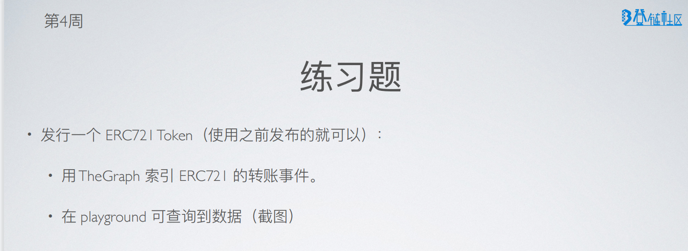
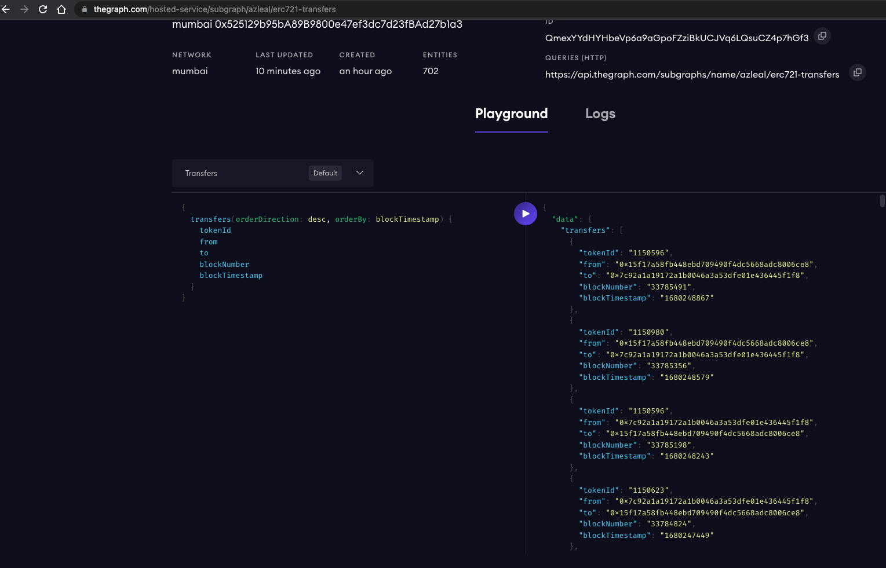
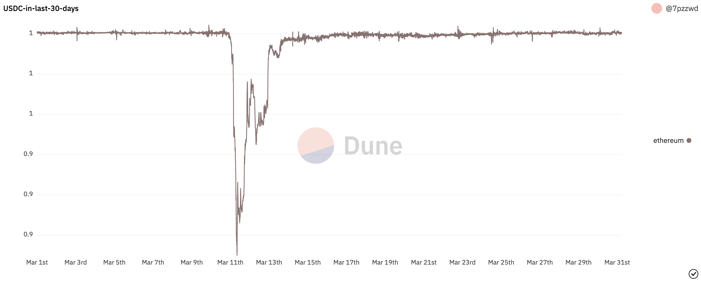

## w4-2作业(2023-03-30)

### 作业说明
> 
> 

1. TheGraph
  - 使用TheGraph所有ERC721的转账事件
  > [代码](./erc721-transfers/)
  > [查询](https://thegraph.com/hosted-service/subgraph/azleal/erc721-transfers)

  - 在playground中显示数据
  

2. 使用Dune查询过去30天USDC的价格变化

[点击查看图表](https://dune.com/7pzzwd/w4-2)



```sql
select * from prices.usd
  where symbol = 'USDC' and blockchain = 'ethereum'
    and DATE_TRUNC('day', minute) >= DATE_TRUNC('day', NOW()) - INTERVAL '30' day
  order by minute 
```

